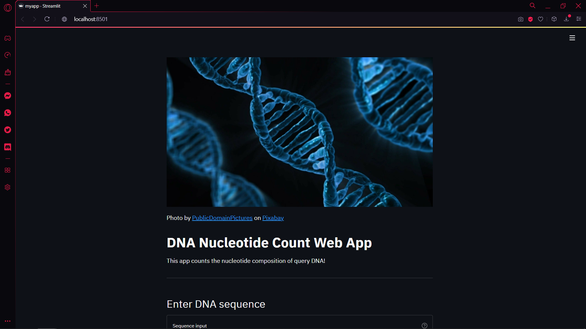
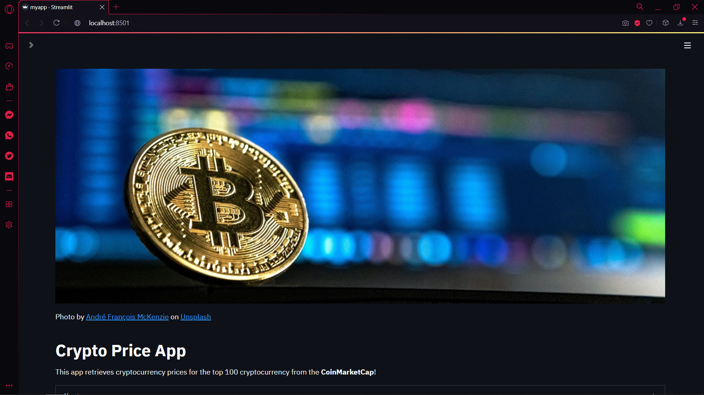

# Some Data Science Apps

Learning how to build data science apps from freeCodeCamp.org

Following this tutorial: [Build 12 Data Science Apps with Python and Streamlit - Full Course](https://www.youtube.com/watch?v=JwSS70SZdyM&list=PLRpb1EfB9cjuOFw_ZVmeqlCgdhYjdbBMO&index=10&ab_channel=freeCodeCamp.org) (actually there are only 10)

The tutorial above covers how to build interactive and data-driven Python web apps using the Streamlit library. This repo contains 9 web apps built from the tutorial with slight modifications.

To install the Streamlit library

```
pip install streamlit
```

To run a web app

```
streamlit run myapp.py
```

## :one: Simple Stock Price App

A simple web app that shows a company's stock. Retrieve stock stock data directly from Yahoo Finance.

Towards Data Science article on [How to Get Stock Data Using Python](https://towardsdatascience.com/how-to-get-stock-data-using-python-c0de1df17e75) (using `yfinance`)

* Using `streamlit` to build basic web app
* Using `yfinance` to get stock price data

<details> 
    <summary>screenshot</summary>
    
</details>

## :two: Simple Bioinformatics DNA Count

A DNA nucleotide count web app which counts the nucleotide composition (A, T, G, C) of a query DNA

* Displaying images
* Taking input and showing output in different formats (dictionary, text, dataframe, plot)

<details> 
    <summary>screenshot</summary>
    
    
    
</details>

## :three: Sports Exploratory Data Analysis App

Web scraping from [Basketball Reference](https://www.basketball-reference.com) and [Football Reference](https://www.pro-football-reference.com/). Performs a simple exploratory data analysis by creating a heatmap. Combined EDA Basketball and EDA Football together.

* Select widget and multiselect widget in `streamlit`
* Web scraping with `pandas`
* Filtering data with conditions in `pandas` (data wrangling)
* Downloading csv files in Streamlit

<details> 
    <summary>screenshot</summary>
    
    
    
</details>

## :four: S&P 500 Stock Price App 

The [S&P 500](https://en.wikipedia.org/wiki/S%26P_500) (the Standard and Poor's 500) is a market-​capitalization-weighted measurement stock market index of the 500 largest companies listed on stock exchanges in the United States. It is one of the most commonly followed equity indices by investors.

A web app that scraps all latest data from the [list of S&P 500 companies](https://en.wikipedia.org/wiki/List_of_S%26P_500_companies) on Wikipedia, fetch their respective stock price data and plot the stock closing price. 

* Web scraping with `pandas`
* Fetching stock price with `yfinance`
* Filtering data with conditions in `pandas` (data wrangling)
* Slider in `streamlit`

<details> 
    <summary>screenshot</summary>
    
</details>

## :five: Cryptocurrency Price App

A web app that scraps the latest cryptocurrency data from [CoinMarketCap](https://coinmarketcap.com). Allow users to select different cryptocurrencies and make comparison. 

Medium article on [Web Scraping Crypto Prices with Python](https://bryanf.medium.com/web-scraping-crypto-prices-with-python-41072ea5b5bf)

* Web scraping with `BeautifulSoup`
* Page layout in `streamlit`

<details> 
    <summary>screenshot</summary>
    
    
</details>

## :six: Simple Iris Flower Prediction App

A web app that predicts the iris flower type from the user input. The prediction will be made using Random Forest Classification. Accept user input parameters (sepal length, sepal width, petal length, petal width) and make a prediction according to a model built from the dataset.

The model applies the [Iris Plants Dataset](https://scikit-learn.org/stable/datasets/toy_dataset.html#iris-plants-dataset) provided in the scikit-learn library

* Uses the RandomForestClassifier model from `sklearn`

<details> 
    <summary>screenshot</summary>
    
    
</details>

## :seven: Simple Palmer Penguin Prediction App