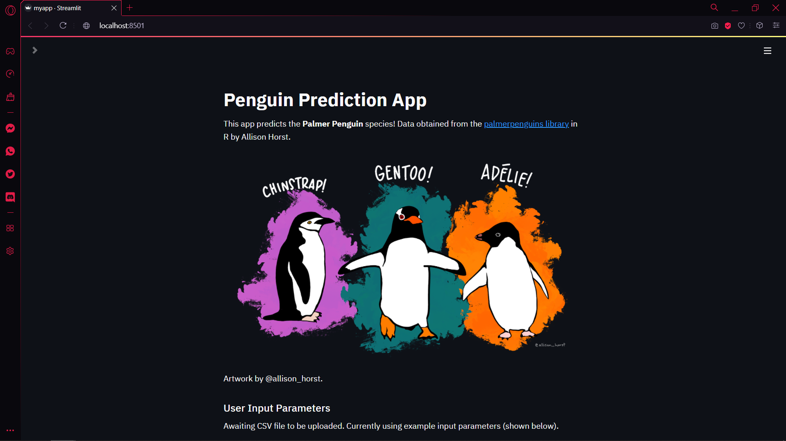

# Data Science Web Apps

Learning how to build data science apps from freeCodeCamp.org

Tutorial by Data Professor: [Build 12 Data Science Apps with Python and Streamlit - Full Course](https://www.youtube.com/watch?v=JwSS70SZdyM&list=PLRpb1EfB9cjuOFw_ZVmeqlCgdhYjdbBMO&index=10&ab_channel=freeCodeCamp.org) (actually there are only 10)

The tutorial above covers how to build interactive and data-driven Python web apps using the Streamlit library. This repo contains 9 web apps built from the tutorial with slight modifications and enhancement.

To install the Streamlit library

```
pip install streamlit
```

To run a web app

```
streamlit run myapp.py
```

List of data science web apps in this repo:

[📈 Simple Stock Price App](#one-simple-stock-price-app)

[🧬 Simple Bioinformatics DNA Count](#two-simple-bioinformatics-dna-count)

[🏃‍♂️ Simple Exploratory Data Analysis App](#three-sports-exploratory-data-analysis-app)

[🏭 S&P 500 Stock Price App](#four-sp-500-stock-price-app)

[💹 Cryptocurrency Price App](#five-cryptocurrency-price-app)

[🌷 Simple Iris Flower Prediction App](#six-simple-iris-flower-prediction-app)

[🐧 Simple Palmer Penguin Prediction App](#seven-simple-palmer-penguin-prediction-app)

[🏡 Boston Housing Price Prediction App](#eight-boston-housing-price-prediction-app)

[🧪 Molecular Solubility Prediction App](#nine-molecular-solubility-prediction-app)

## :one: Simple Stock Price App

A simple web app that shows the stock price of multiple multinational companies. Retrieve stock data directly from Yahoo Finance.

Towards Data Science article on [How to Get Stock Data Using Python](https://towardsdatascience.com/how-to-get-stock-data-using-python-c0de1df17e75) (using `yfinance`)

* Using `streamlit` to build a basic web app
* Using `yfinance` to get stock price data

<details> 
    <summary>screenshot</summary>
    
</details>

## :two: Simple Bioinformatics DNA Count

A DNA nucleotide count web app that counts the nucleotide composition (A, T, G, C) of a query DNA

* Displaying images
* Taking input and showing output in different formats (dictionary, text, dataframe, plot)

<details> 
    <summary>screenshots</summary>
    
    
    
</details>

## :three: Sports Exploratory Data Analysis App

Web scraping from [Basketball Reference](https://www.basketball-reference.com) and [Football Reference](https://www.pro-football-reference.com/). Performs a simple exploratory data analysis by creating a heatmap. Combined EDA Basketball and EDA Football together.

* Select widget and multiselect widget in `streamlit`
* Web scraping with `pandas`
* Filtering data with conditions in `pandas` (data wrangling)
* Downloading CSV files in `streamlit`

<details> 
    <summary>screenshots</summary>
    
    
    
</details>

## :four: S&P 500 Stock Price App 

The [S&P 500](https://en.wikipedia.org/wiki/S%26P_500) (the Standard and Poor's 500) is a market-​capitalization-weighted measurement stock market index of the 500 largest companies listed on stock exchanges in the United States. It is one of the most commonly followed equity indices by investors.

A web app that scraps all latest data from the [list of S&P 500 companies](https://en.wikipedia.org/wiki/List_of_S%26P_500_companies) on Wikipedia, fetch their respective stock price data and plot the stock closing price. 

* Web scraping with `pandas`
* Fetching stock price with `yfinance`
* Filtering data with conditions in `pandas` (data wrangling)
* Slider in `streamlit`

<details> 
    <summary>screenshot</summary>
    
</details>

## :five: Cryptocurrency Price App

A web app that scraps the latest cryptocurrency data from [CoinMarketCap](https://coinmarketcap.com). Allow users to select different cryptocurrencies and make comparisons. 

Medium article on [Web Scraping Crypto Prices with Python](https://bryanf.medium.com/web-scraping-crypto-prices-with-python-41072ea5b5bf)

* Web scraping with `BeautifulSoup`
* Page layout in `streamlit`

<details> 
    <summary>screenshots</summary>
    
    
</details>

## :six: Simple Iris Flower Prediction App

A web app that predicts the iris flower type from the user input. The prediction is made by using a Random Forest Classification. Accepts user input parameters (sepal length, sepal width, petal length, petal width) and predict using a model built from the dataset.

The model applies the [Iris Plants Dataset](https://scikit-learn.org/stable/datasets/toy_dataset.html#iris-plants-dataset) provided in the scikit-learn library.

* Built a classifier using the RandomForestClassifier model from `sklearn`

<details> 
    <summary>screenshots</summary>
    
    
</details>

## :seven: Simple Palmer Penguin Prediction App

Predicts the palmer penguin species (Chinstrap, Gentoo, and Adélie penguins) by using a classification model. Accepts user input in the form of CSV file upload or direct input.

The original [Palmer Penguins Dataset](https://allisonhorst.github.io/palmerpenguins/articles/intro.html) is provided by Allison Horst. The model in this web app uses the [cleaned dataset](https://github.com/dataprofessor/data/blob/master/penguins_cleaned.csv) provided by Data Professor.

* Built a classifier using the RandomForestClassifier model from `sklearn`
* File uploader in `streamlit`

<details> 
    <summary>screenshots</summary>
    
    
    CSV file upload
    
    Slider input
    
</details>

## :eight: Boston Housing Price Prediction App

Predicts the median value of Boston House Price from the given input parameters which consists of:

* **crim**: per capita crime rate by town.
* **zn**: proportion of residential land zoned for lots over 25,000 sq.ft.
* **indus**: proportion of non-retail business acres per town.
* **chas**: Charles River dummy variable (= 1 if tract bounds river; 0 otherwise).
* **nox**: nitrogen oxides concentration (parts per 10 million).
* **rm**: average number of rooms per dwelling.
* **age**: proportion of owner-occupied units built prior to 1940.
* **dis**: weighted mean of distances to five Boston employment centres.
* **rad**: index of accessibility to radial highways.
* **tax**: full-value property-tax rate per \$10,000.
* **ptratio**: pupil-teacher ratio by town.
* **b**: 1000(Bk - 0.63)^2 where Bk is the proportion of blacks by town.
* **lstat**: lower status of the population (percent).

The regression model uses Random Forest Regressor, trained by the [Boston House Prices Dataset](https://scikit-learn.org/stable/datasets/toy_dataset.html#boston-house-prices-dataset) provided in the scikit-learn library. The model's prediction is explained by [SHAP values](https://github.com/slundberg/shap).

* Built a regressor using the RandomForestRegressor model from `sklearn`
* Using `shap` to explain the outcome of the prediction

<details> 
    <summary>screenshots</summary>
    
    
    
    
</details>

## :nine: Molecular Solubility Prediction App

Predict the solubility value (LogS) of input molecules. The input molecules must be in the [SMILES](https://en.wikipedia.org/wiki/Simplified_molecular-input_line-entry_system) notation. With the help of the RDKit library, this app will compute four descriptors for each molecule:

* MolLogP
* Molecular Weight
* Number Of Rotatable Bonds
* Aromatic Proportion

These four variables are crucial to the Linear Regression model as suggested by John S. Delaney in [ESOL:  Estimating Aqueous Solubility Directly from Molecular Structure](https://pubs.acs.org/doi/10.1021/ci034243x). A [cleaned dataset](https://github.com/dataprofessor/data/blob/master/delaney_solubility_with_descriptors.csv) for training the model is provided by Data Professor.

The installation of the RDKit library using pip can be impossible for now, hence it is suggested to [Install RDKit with Conda](https://www.rdkit.org/docs/Install.html). This includes creating a conda environment for the installation.

* Built a regressor using the LinearRegression model from `sklearn`
* Using `rdkit` for computing the required variables for the prediction


<details> 
    <summary>screenshots</summary>
    
    
</details>
